# ezbooking - Event Ticketing App Flutter

**ezbooking** is a comprehensive event ticketing system designed to manage events, process ticket sales, and provide different access levels for users: Admin, Organizers, and Users. This application streamlines the event booking process, and with the addition of **VNPAY Payment Gateway**, it enables secure and convenient online payments for users.

## Features

- **Admin Role**: Full control over the platform, including user management, event creation, and comprehensive oversight of tickets and bookings.
- **Organizer Role**: Allows event organizers to create and manage their own events, view orders, track income, and customize event details.
- **User Role**: Enables users to browse available events, purchase tickets, and join events.

### VNPAY Payment Integration

The system integrates with **VNPAY**, a leading online payment gateway in Vietnam. This allows users to complete ticket purchases securely through various payment methods, including bank cards, QR codes, and more.

**Key Features of VNPAY Integration**:
- **Secure Payments**: VNPAY provides secure online payment processing, ensuring users' payment details are protected.
- **Multiple Payment Methods**: Users can choose from a variety of payment options such as credit/debit cards, bank transfers, and VNPAY QR code scanning.
- **Real-time Payment Confirmation**: After a user completes a payment, the system automatically updates the booking status and sends a confirmation email.
- **Easy Integration**: The VNPAY API is integrated seamlessly into the *ezbooking* platform, making it easy for users to check out and complete transactions within the event ticketing flow.

## Tech Stack

- **Frontend**: Flutter (Mobile & Web)
- **Backend**: Firebase (Firestore, Authentication)
- **Payment Gateway**: VNPAY API
- **State Management**: BLoC
- **Architecture**: Clean Architecture

## Screenshots

### Home Page
<div style="display: flex; gap: 10px;">
  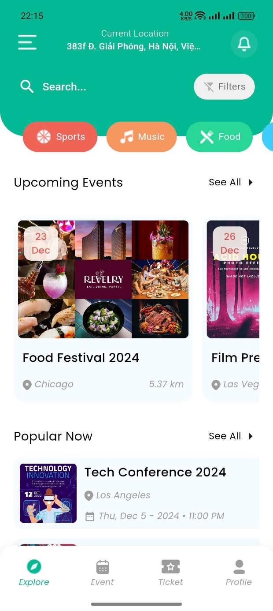
  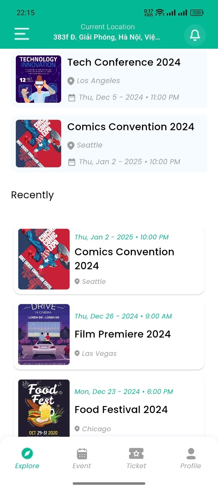
</div>

### Event Listing
<div style="display: flex; gap: 10px;">
  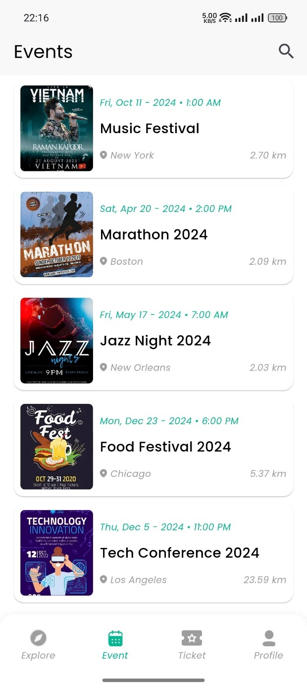
  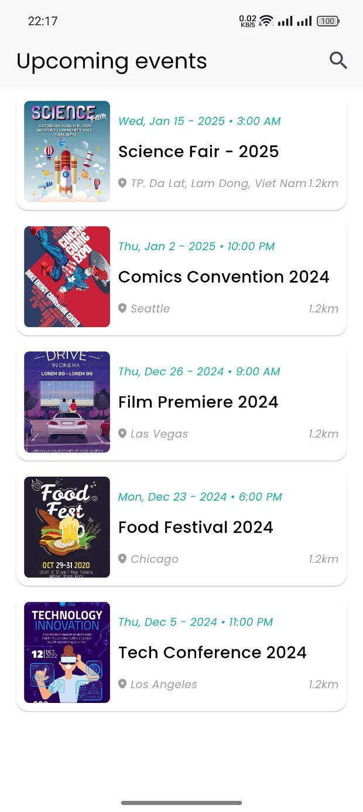
</div>

### Event Details
<div style="display: flex; gap: 10px;">
  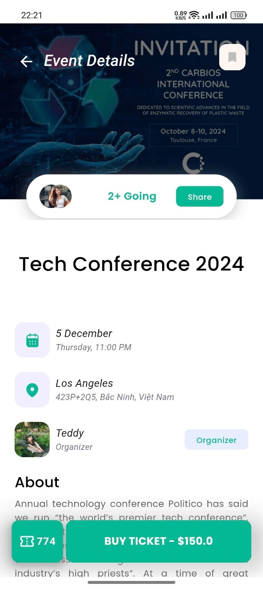
  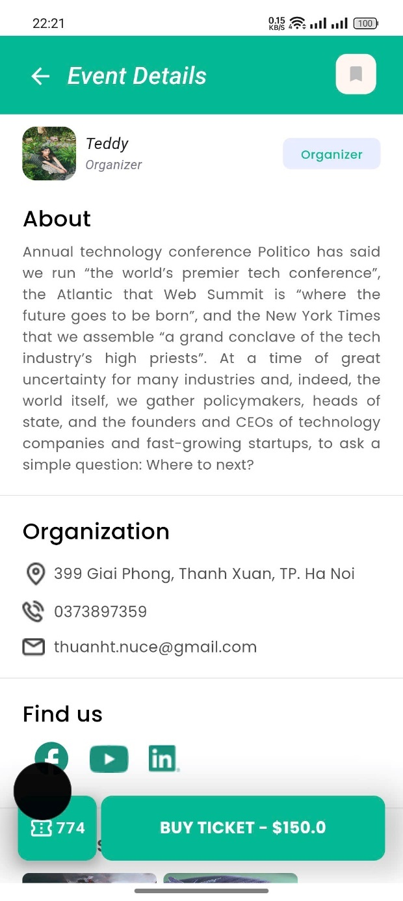
</div>

### My tickets
<div style="display: flex; gap: 10px;">
  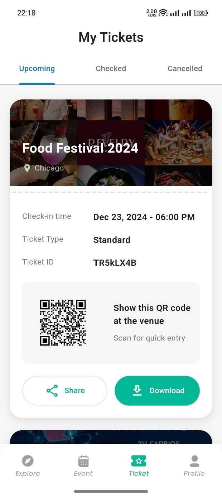
  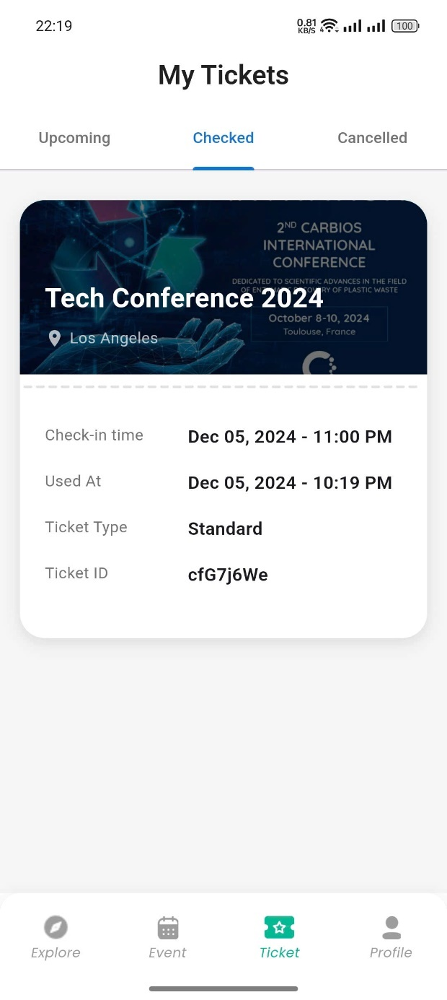
  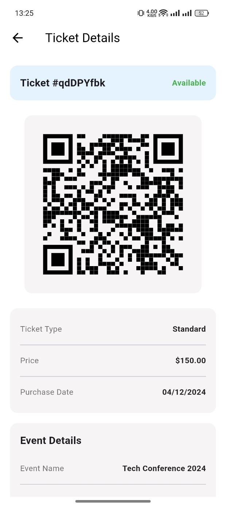
</div>

### Personal
<div style="display: flex; gap: 10px;">
  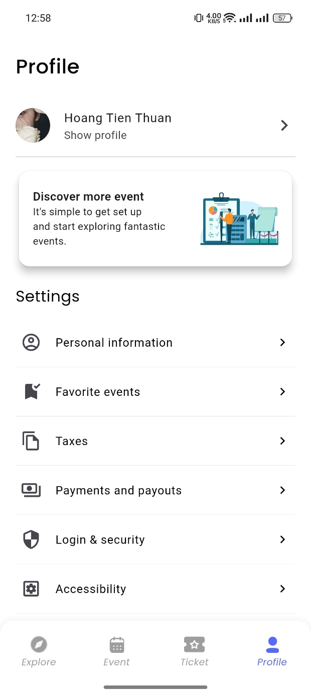
</div>

### Others
<div style="display: flex; gap: 10px;">
  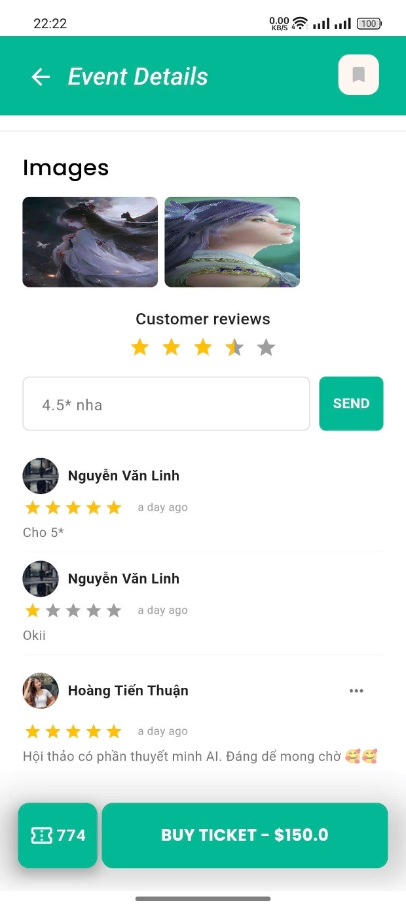
  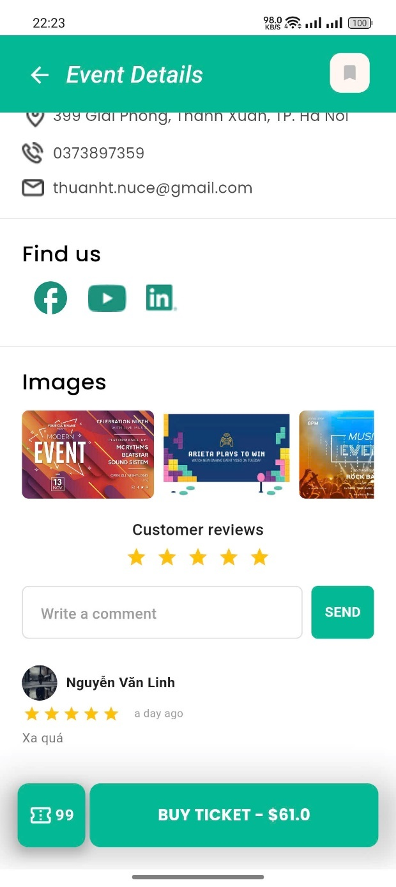
  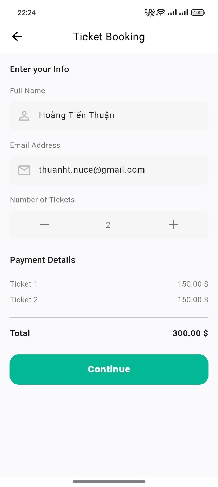
  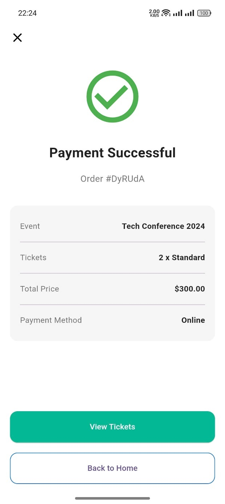
  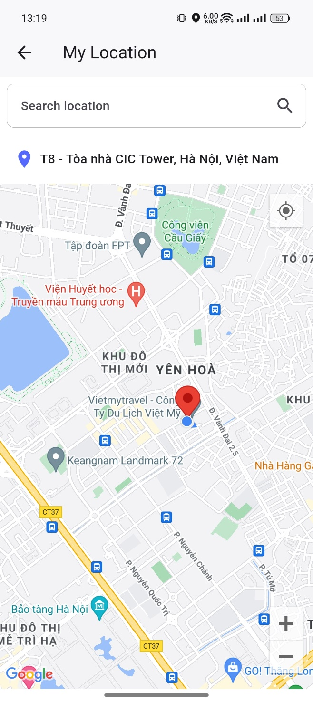
  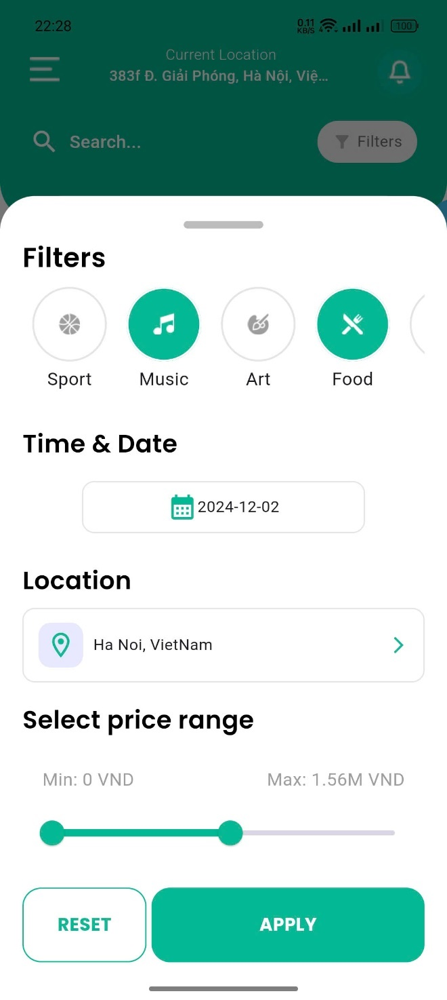
  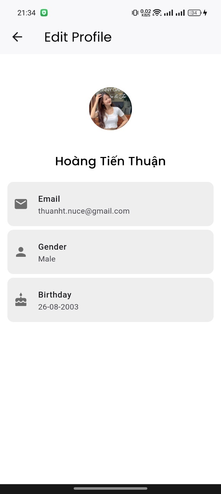
  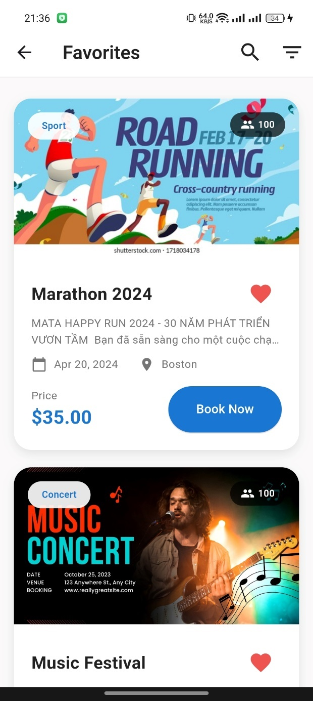
  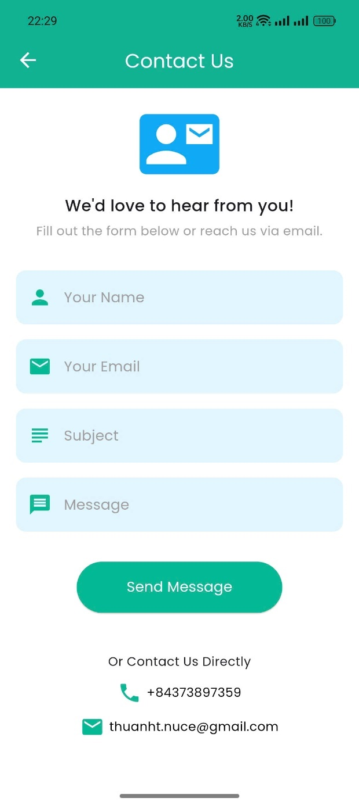
  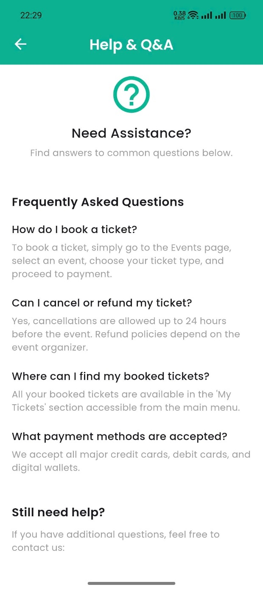
</div>


*Add your screenshots in the `screenshots` directory to display them here.*

## Setup

### Prerequisites

- Flutter installed on your machine: [Flutter installation guide](https://flutter.dev/docs/get-started/install)
- Firebase project set up and connected: [Firebase setup guide](https://firebase.google.com/docs/flutter/setup)
- **VNPAY Merchant Account**: To integrate VNPAY, you need a VNPAY Merchant account and API keys. Please follow the [VNPAY integration documentation](https://www.vnpay.vn/) for details.

### Installation

1. Clone the repository:
   ```bash
   git clone https://github.com/thuanyg/ezbooking.git
   cd ezbooking
